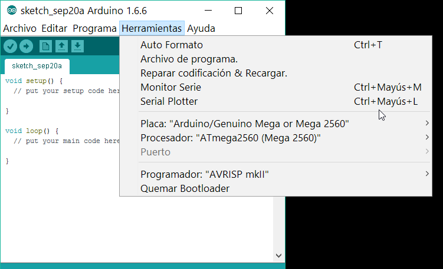

# Conexión a la impresora y carga del firmware

Teniendo el firmware configurado, ya estamos en condiciones de conectar la impresora para cargarlo y hacer las primeras pruebas.

Conectamos el cable USB al PC/Mac que estemos utilizando. Eso es suficiente para alimentar el Arduino que lleva la impresora para cargar el firmware.

Antes de poder cargar el firmware, tenemos que hacer una pequeña configuración en el Arduino IDE para indicarle qué procesador estamos usando y en que puerto está conectado. En la barra de menús, seleccionamos "Herramientas" y en el desplegable hay que modificar "Placa", "Procesador" y "Puerto".

Placa y Procesador, según se indica en la imagen anterior.

Puerto: se activa si el PC detecta un Arduino. Si está en gris (como en la imagen) indica que el PC no reconoce ningún Arduino conectado.

Una vez conectado al puerto, hay que ver si la velocidad es compatible y si no configurarla. Para eso vamos al mismo menú y seleccionamos "Monitor Serie".
