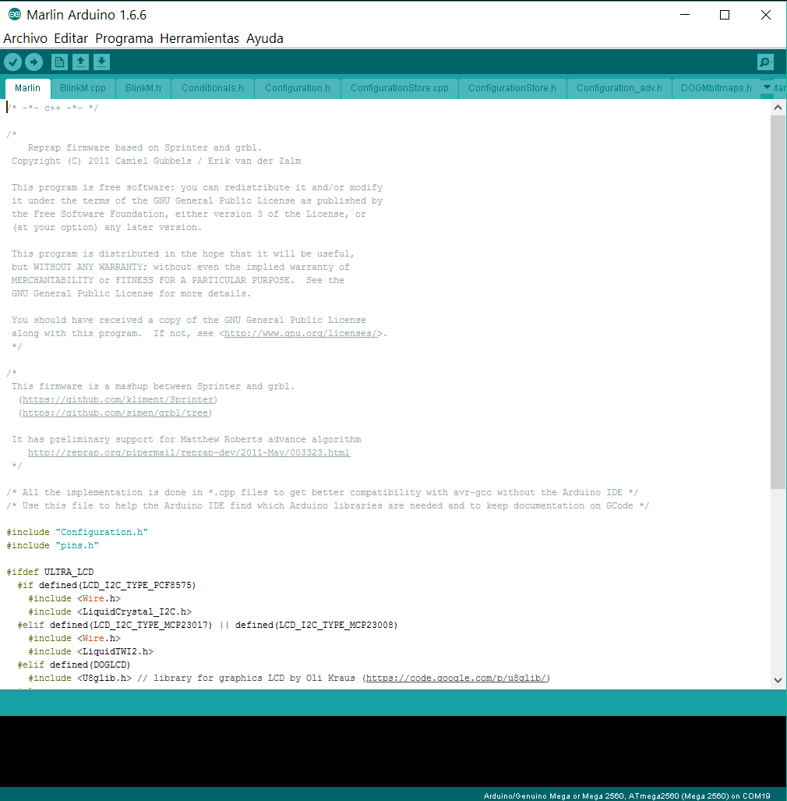
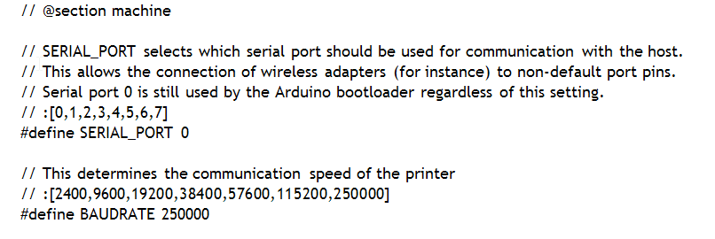

# Modificaciones al firmware (Marlin)

El firmware estándar está en el GitHub de la M'One:

  [Marlin para la M'One](https://github.com/M-Prime/M_Prime_One/tree/master/firmware/Marlin)
  
El firmware consiste en un programa principal (**Marlin.ino**) y un montón de ficheros de configuración ***.h**

De esos ficheros probablemente sólo tendremos que modificar "configuration.h" y sólo si hemos utilizado componentes distintos al estándar de la M'One (como en mi caso, por ejemplo el extrusor).

Así es como se vé Marlin dentro del Arduino IDE:

En la parte superior de la pantalla están las pestañas con los archivos que componen Marlin. La quinta pestaña es "Configuration.h", donde se concentran la mayoría de los parámetros de configuración. Hay que abrirlo y modificarlo (si es preciso).

Lo primero que hay que revisar es la velocidad de conexión serie:

En mi caso utilizo PCs antiguos que no soportan 250000 Baud y tengo que bajar la velocidad a 115200.

El siguiente parámetro que tuve que configurar fueron los finales de carrera. Normalmente se usan finales de carrera "normalmente abiertos", es decir que el final de carrera cierra un circuito que el Arduino entiende como que el eje asociado (X, Y o Z) ha llegado al extremo y para el motor.
Esto, que es una práctica habitual, tiene un problema: Si por cualquier causa alguno de los cables que conectan los finales de carrera se rompe o se desuelda, Arduino no se entera nunca de que ha llegado al final de carrera y sigue impulsando el motor contra el extremo del carro correspondiente.
Yo he preferido utilizar la configuración "normalmente cerrados", es decir que el circuito permanece cerrado hasta que llega al final de carrera, momento en el que se abre el circuito y el Arduino para el motor. Si por cualquier causa uno de los cables del final de carrera se desoldase o se partiese, en ese mismo momento el Arduino consideraría que ha llegado al final de carrera y pararía el motor, evitando choques contra los extremos.
El síntoma sería claro: el eje correspondiente no se movería en absoluto y nos permitiría deducir el problema.

Por último, los parámetros del extrusor y del movimiento de los ejes:

80,80,400 Corresponden a los pasos que deben mover los motores X, Y y Z por unidad de longitud. 237.17 son los pasos que debe mover el motor del extrusor para avanzar una unidad de longitud. Este último parámetro hay que ajustarlo para que la extrusión sea perfecta.

